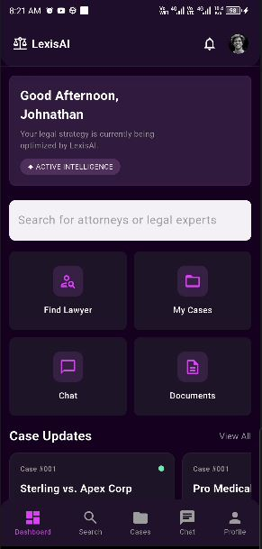

# ⚖️ Lexis AI

### AI-Powered Legal Assistance & Lawyer Consultation App

**Lexis AI** is a modern Flutter-based legal assistance application focused on providing a clean and user-friendly experience for clients and lawyers.

This project currently focuses on **UI/UX design and frontend implementation**, with backend and Firebase integration planned for future development.

### Current Features

-  Client & Lawyer UI
-  Find & Hire Lawyer UI
-  Case Management UI
-  Chat Interface
-  AI Legal Assistance UI
-  Document Management UI
-  Notifications UI
-  Profile & Settings
-  Modern Dark-Themed UI

### Technologies

- **Flutter**
- **Dart**
- **GetX**
- **MVC Architecture**

### Future Development

- Firebase Authentication
- Cloud Firestore
- Firebase Storage
- Firebase Cloud Messaging
- Real-time Chat
- Dynamic Lawyer & Case Data
- AI Integration
## App Screenshots

<table>
<tr>
<td align="center"><b>1.Onboarding 1</b> </td>
<td align="center"><b>2.Onboarding 2</b> </td>
<td align="center"><b>3.Onboarding 3</b> </td>
</tr>

<tr>
<td align="center"><b>4.Login</b> </td>
<td align="center"><b>5.Sign Up</b> </td>
<td align="center"><b>6.Dashboard</b> </td>
</tr>

<tr>
<td align="center"><b>7.Find Lawyers</b> </td>
<td align="center"><b>8.Hire Lawyer</b> </td>
<td align="center"><b>9.Cases</b> </td>
</tr>

<tr>
<td align="center"><b>10.Case Preview</b> </td>
<td align="center"><b>11.Chat User</b> </td>
</tr>

<tr>
<td align="center"><b>12.Documents</b> </td>
<td align="center"><b>13.Profile</b> </td>
<td align="center"><b>14.Settings</b> </td>
</tr>
</table>

